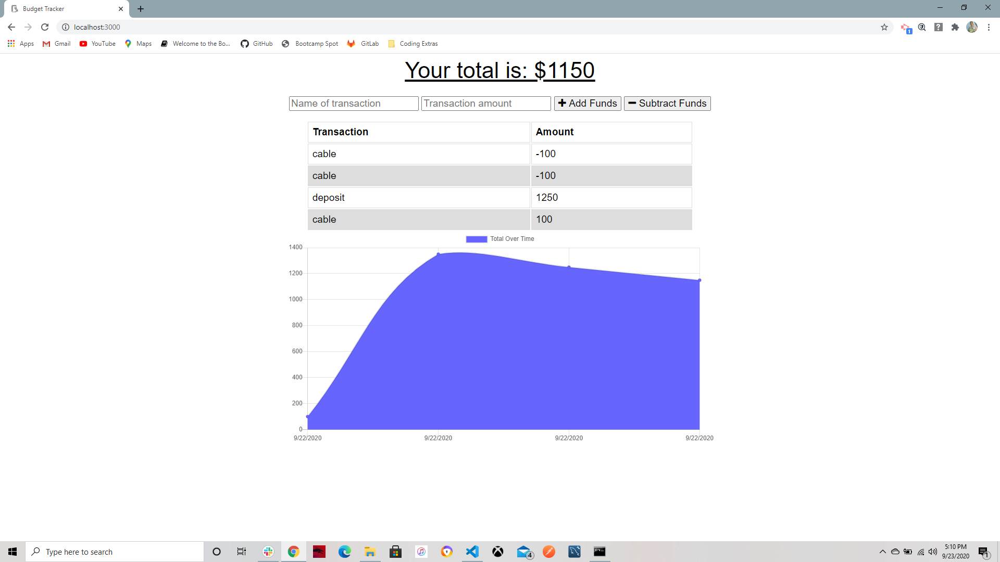

# Progressive-Budget

>Budgeting on the go!

---

### Table of Contents

* [Description](#description)
* [How To Use](#how-to-use)
* [References](#references)
* [License](#license)
* [Author Info](#author-info)

---

## Description
AS AN avid traveller I WANT to be able to track my withdrawals and deposits with or without a data/internet connection SO THAT my account balance is accurate when I am traveling 

#### Technologies

- Express
- MongoDB
- Manifest
- Service-Worker

---

## How To Use

#### Installation

#### API Reference
None

[Back To The Top](#progressive-budget)

---

## References
- Heroku - [Heroku](https://warm-woodland-58171.herokuapp.com/)

[Back To The Top](#progressive-budget)

---

## License

Copyright(c) [2020] [Erin K Fisher]

[Back To The Top](#progressive-budget)

---

## Author Info

- GitHub - [FisherE20](https://github.com/FisherE20/Progressive-Budget)
- Website - [FisherE20](https://fishere20.github.io/Responsive-Portfolio/) 

[Back To The Top](#progressive-budget)